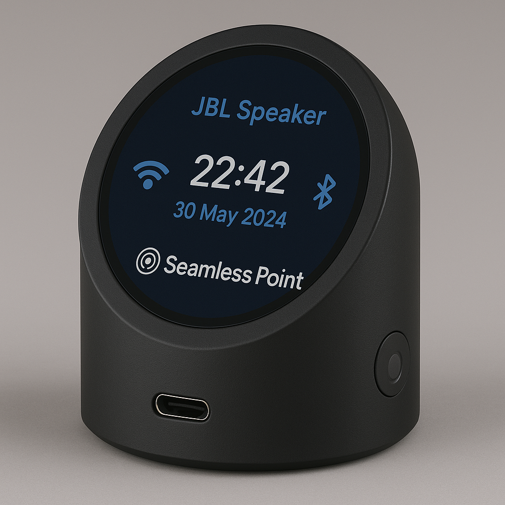

**The Universal Audio Hub for Music, Media & Gaming**

Seamless Point is a modern, minimalist audio device that seamlessly connects all your sound sources and outputs—whether you're listening to music, watching movies, or diving into high-performance PC gaming. Compatible with AirPlay, USB audio, and wireless speakers, it acts as a smart audio bridge between your devices and your environment.

Designed for gamers and audiophiles alike, Seamless Point doubles as a **dedicated PC gaming audio station**, offering ultra-low latency sound routing, crystal-clear output, and flexible device switching. Whether you're using USB headphones, studio monitors, or Bluetooth headsets, Seamless Point keeps everything in sync—so your experience is uninterrupted, immersive, and effortless.

From everyday listening to competitive gameplay, Seamless Point brings all your audio together into one intelligent, elegant system.

Guides for building and managing seamless point yocto image.

Hardware render
-----------------


Build yocto image
-----------------

0. Add project path as environment variable to bashrc:
  ```bash
  nano ~/.bashrc
  ```

  ```bash
  export sp="~/Documents/seamless-point"
  ```

  ```bash
  source ~/.bashrc
  ```

1. Install dependencies (Ubuntu 24.04):
  ```bash
  sudo apt install -y gawk wget git-core diffstat unzip texinfo gcc-multilib \
    build-essential chrpath socat cpio python3 python3-pip python3-pexpect \ 
    xz-utils debianutils iputils-ping python3-git python3-jinja2 libegl1 \
    libsdl1.2-dev pylint xterm lz4 m4 gettext autoconf automake libtool \
    libncurses-dev libncursesw5-dev
  ```

2. Undo restriction of unprivileged user namespaces:
  ```bash
  sudo sysctl kernel.apparmor_restrict_unprivileged_userns=0
  ```

3. Sync seamless-point project:
  ```bash
  mkdir -p seamless-point && cd seamless-point/
  ```

  ```bash
  repo init -u git@github.com:kuzhylol/seamless-point-manifest.git -b yocto-next
  ```

  ```bash
  repo sync -j$(nproc)
  ```

4. Initialize Yocto build environment:
  ```bash
  TEMPLATECONF=$sp/meta-seamless-point/conf/templates/sp-main source $sp/poky/oe-init-build-env
  ```

5. Set machine for build:
  ```bash
  MACHINE = "qemux86-64"
  ```

6. Create image: 
  ```bash
  cd $sp/build/ && bitbake core-image-minimal
  ```

7. Run image:
  ```bash
  cd $sp && source $sp/poky/oe-init-build-env build
  ```

  ```bash
  export DEPLOY_DIR_IMAGE=$PWD/tmp/deploy/images/qemux86-64
  ```

  ```bash
  export IMAGE_LINK_NAME=core-image-minimal-qemux86-64
  ```

  ```bash
  runqemu qemux86-64
  ```

Error handling
--------------

1. Error: ***NOTE: Reconnecting to bitbake server... NOTE: No reply from server in 30s***. Fix:
  ```bash
  rm $sp/build/*.lock $sp/build/*.sock
  ```

2. Error: ***Task (seamless-point/poky/meta/recipes-devtools/binutils/task.bb:do_compile) failed with exit code '1'.***. Fix:
  ```bash
  bitbake task -c cleansstate && bitbake task
  ```

